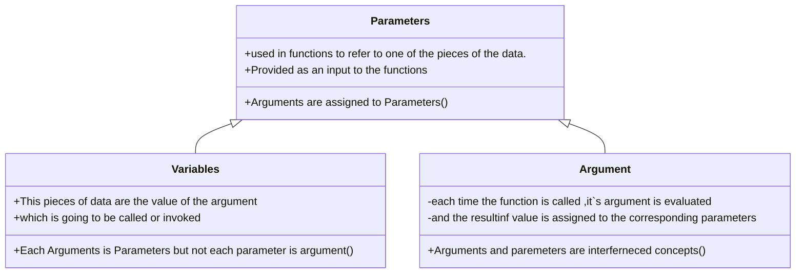

##### Parameters is special kind of variable used in subroutines to refer to one of the pieces of data provided as input to the subroutines.
>Parameters : is a variable which is part of methods signature . 
as Parameters = variables

#### Parameter : is a special kind of variables used in function  

